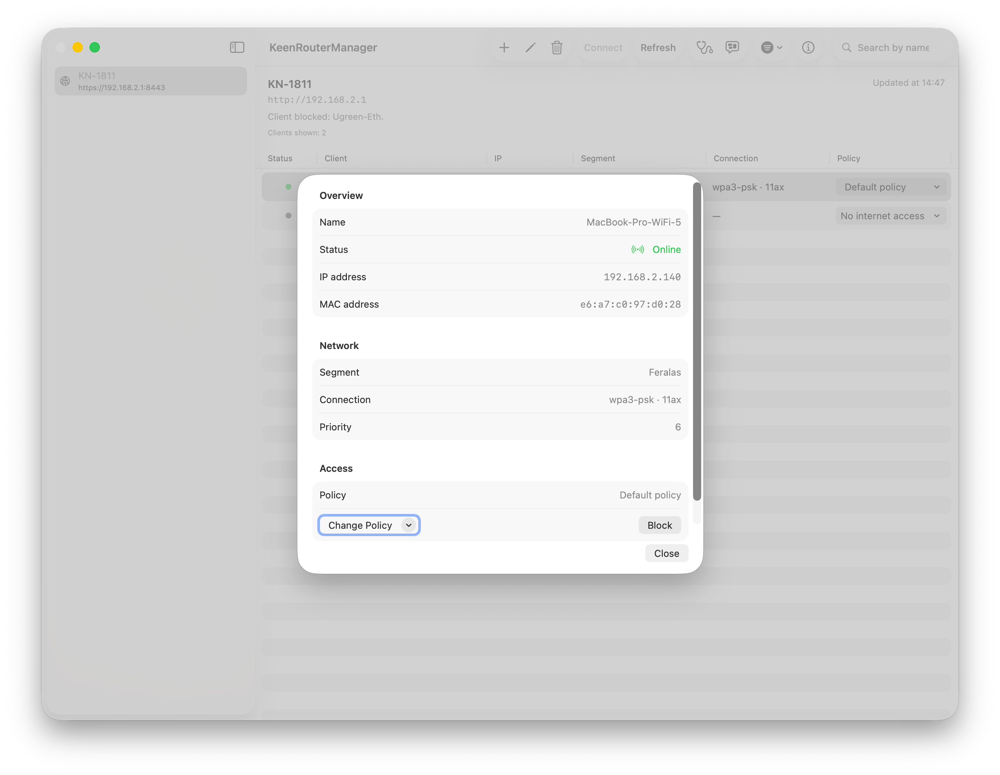

  <picture>
    
  </picture>

<h1 align="center">KeenRouterManager</h1>

  Native macOS app for managing Keenetic and Netcraze router client profiles.

  
  
  
  
  

  <a href="https://github.com/Tarisper/KeenRouterManager/releases">Download</a>
  ·
  <a href="https://github.com/Tarisper/KeenRouterManager/wiki">Wiki</a>
  ·
  <a href="https://github.com/Tarisper/KeenRouterManager/releases/latest">Latest Release</a>

## Features

- Connects to a router using:
  - KeenDNS (`http` / `https`)
  - local DNS name (`http` / `https`)
  - IP address (including custom port)
- Stores router profiles locally in JSON.
- Stores router passwords in the macOS Keychain.
- Stores UI settings locally in JSON.
- Searches router clients by name, IP, MAC, policy, and segment.
- Filters router clients by online status, blocking state, policy, segment, and `My Devices`.
- Sorts router clients by smart order, name, IP, policy, or segment.
- Displays router clients in a native macOS table with a details sheet.
- Client sorting: online devices first, then by name.
- Assigns access policies to clients.
- One-click internet blocking for a selected client.
- `My Devices` filter: shows only clients whose MAC addresses match local MAC addresses on this Mac.
- Network overview sheet with connection summary, client counters, and segment/policy breakdowns.
- Router diagnostics helper for endpoint and authentication checks.
- Configuration import/export in JSON format.
- Settings window with interface language selection.
- Localized interface strings loaded from JSON (`Russian` / `English`).
- Native macOS menu bar, toolbar, sidebar, searchable content, and sheet-based detail patterns.

## Tech Stack

- Swift
- SwiftUI (`NavigationSplitView`, `Table`, `searchable`, `sheet`, `Settings`, `Window`)
- URLSession + Keenetic JSON API
- JSON-based runtime localization
- Security framework (`Keychain Services`) for password storage
- SwiftUI `FileDocument` for configuration transfer

## Download

Prebuilt application bundles are available in GitHub Releases.

1. Open the Releases page of this repository.
2. Download either `KeenRouterManager.dmg` or `KeenRouterManager.app.zip` from the latest release.
3. Open the downloaded file and move `KeenRouterManager.app` to `Applications`.

## Requirements for Building from Source

- Xcode (full installation, not Command Line Tools only)
- macOS 15.5 or newer (current app target deployment version)

## Build and Run

1. Open `KeenRouterManager.xcodeproj` in Xcode.
2. Select the `KeenRouterManager` scheme.
3. Press `Run`.

The project currently requires a full Xcode installation. `xcodebuild` is not available when only Command Line Tools are selected.

## Project Structure

- `KeenRouterManager/KeenRouterManagerApp.swift` - app entry point and scene wiring.
- `KeenRouterManager/ContentView.swift` - main router browser window with sidebar, search, filters, table, and client details sheet.
- `KeenRouterManager/MainViewModel.swift` - business logic and UI state.
- `KeenRouterManager/KeeneticAPIClient.swift` - Keenetic HTTP API client.
- `KeenRouterManager/Models.swift` - domain models.
- `KeenRouterManager/RouterEditorView.swift` - router profile create/edit form with diagnostics.
- `KeenRouterManager/SettingsView.swift` - settings window UI.
- `KeenRouterManager/DashboardView.swift` - network overview sheet.
- `KeenRouterManager/ConnectionDiagnosticsView.swift` - diagnostics sheet and report UI.
- `KeenRouterManager/RouterConfigurationDocument.swift` - import/export document format.
- `KeenRouterManager/RouterCommands.swift` - native macOS menu commands.
- `KeenRouterManager/AppUIState.swift` - shared presentation state for import/export, network overview, and diagnostics.
- `KeenRouterManager/LocalizationManager.swift` - runtime localization loader and language selection state.
- `KeenRouterManager/InterfaceStrings.json` - localized interface strings.
- `KeenRouterManager/RouterProfileStore.swift` - file storage for router profiles.
- `KeenRouterManager/CredentialsStore.swift` - Keychain-backed password storage.
- `KeenRouterManager/AppSettingsStore.swift` - file storage for UI settings.
- `KeenRouterManager/LocalMACAddressProvider.swift` - local MAC address discovery.
- `Info.plist` - app bundle metadata and declared localizations.

## Data Storage

By default, files are stored in `~/Library/Application Support/KeenRouterManager/`:

- `routers.json` - router profiles
- `settings.json` - UI settings (for example, `My Devices` filter state, selected interface language, and router list visibility)

Router passwords are stored in the system Keychain.

Configuration export files intentionally exclude passwords. Exported JSON contains router profiles and app settings only; imported profiles continue using Keychain passwords already available on the current Mac.

## Notes and Limitations

- Some routers/firmware versions do not accept HTTPS over IP (TLS/SNI limitation), so the app uses scheme/port fallback.
- macOS network diagnostics may print verbose log lines (`boringssl`, `nw_endpoint_flow_*`) during failed fallback attempts.
